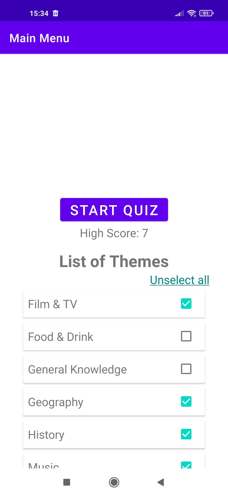

# QuiZ
Learn about art, sports, science & more with this trivia game 
This App is using [The Trivia API](https://the-trivia-api.com/) as a remote data source

Get the APK
---------------
Version (1.0) [Link](versions/quizAPI.apk)

Screenshots
-----------

")
")

Application features
---------------
* Over 7000 various questions
* Selection by themes
* Highscore

Work with
---------------
* MVVM
* Single Activity
* Kotlin Coroutines
* [Dependency Injection (pattern Container)](https://developer.android.com/training/dependency-injection/manual)
* Custom Navigation
* Retrofit
